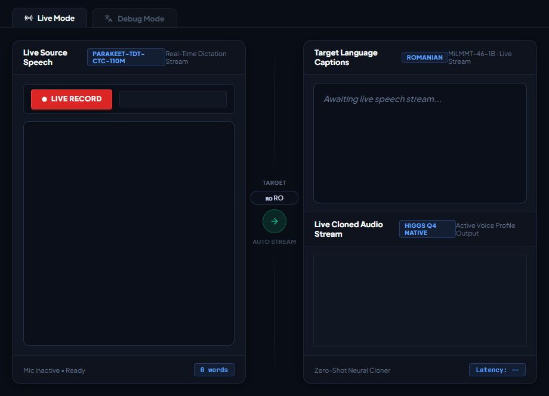
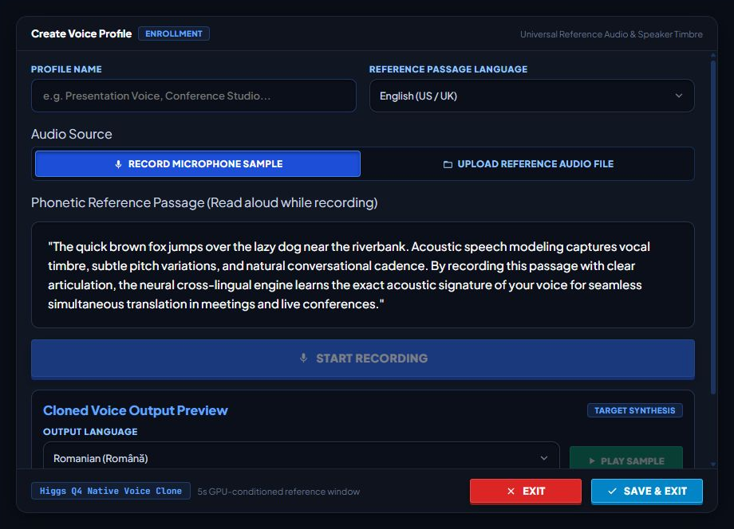
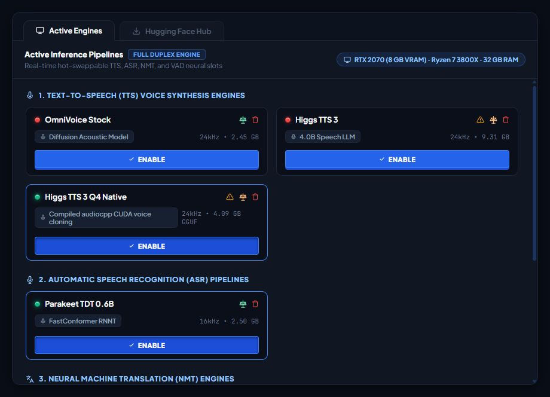
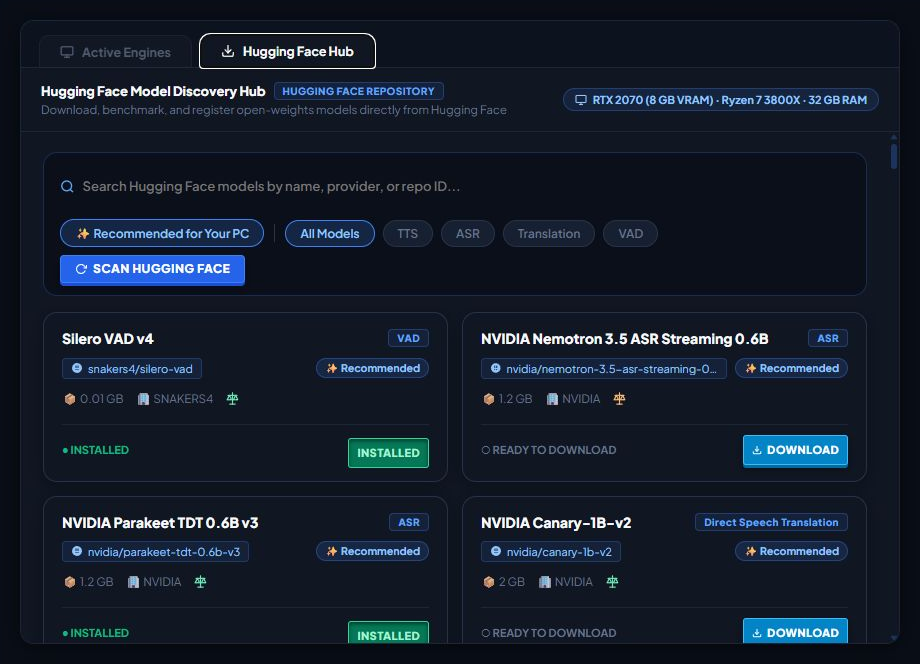

<div align="center">


# VoxPassport
### Local-First Live Translation, Captions, Voice Cloning & Text-to-Speech

<p>
  A local-first platform for live speech translation with synchronized captions, speech-to-text, text translation, voice cloning, synthesized speech, and live conversation workflows.
</p>

<p>
  <a href="https://www.python.org/"></a>
  <a href="https://pytorch.org/"></a>
  <a href="https://huggingface.co/"></a>
  <a href="https://github.com/huggingface/transformers"></a>
  <a href="https://developer.nvidia.com/cuda-zone"></a>
</p>

</div>

---

## Project Overview

**VoxPassport** is a modular local-first audio and language platform for live multilingual conversation and standalone speech workflows. It can capture speech, detect voice activity, transcribe, translate, synthesize translated speech, route that audio to the correct listener/conference input, and publish synchronized captions. No single workflow requires every capability to be enabled.

VoxPassport began as a way to support natural conversations with family members in Romania despite a language barrier. English ↔ Romanian remains the primary development and benchmark pair, but the runtime is language-pair driven; actual language support is determined by the selected ASR, translation, and TTS models.

Voice identity is treated as a first-class capability. A saved voice profile is model-independent and can be consumed by any compatible cloning-capable TTS model.

## Product Interface

<table>
  <tr>
    <td width="50%"></td>
    <td width="50%"></td>
  </tr>
  <tr>
    <td align="center"><strong>Live Translator Studio</strong><br />Full-duplex speech, captions, and cloned-audio monitoring.</td>
    <td align="center"><strong>Voice Profile Studio</strong><br />Reference recording, enrollment, and cross-lingual preview.</td>
  </tr>
  <tr>
    <td width="50%"></td>
    <td width="50%"></td>
  </tr>
  <tr>
    <td align="center"><strong>Active Inference Engines</strong><br />Hot-swappable TTS, ASR, translation, and VAD slots.</td>
    <td align="center"><strong>Model Discovery Hub</strong><br />Hardware-aware model discovery, licensing, and installation.</td>
  </tr>
</table>

---

# Key Features

## Full-Duplex Multilingual Translation

```text
Local Microphone                         Remote Conference Audio
      │                                           │
      ▼                                           ▼
     VAD                                         VAD
      │                                           │
      ▼                                           ▼
     ASR                                         ASR
      │                                           │
      ▼                                           ▼
 Translation                                  Translation
      │                                           │
      ▼                                           ▼
 TTS / Voice Clone                           TTS / Voice Clone
      │                                           │
      ▼                                           ▼
Virtual Microphone                           Local Monitor
```

Both directions maintain independent language/routing state while physical model instances can be shared. The low-VRAM design can share one Parakeet ASR model, one MiLMMT translation model, and one active TTS model across both directions.

## Engine-Independent Voice Profiles

```text
Reference recording
+ optional exact transcript
              ↓
      Universal voice profile
              ↓
   Active cloning-capable TTS
              ↓
Translated or supplied target text
              ↓
Speech in the enrolled speaker's voice
```

The transcript is optional unless the selected TTS manifest declares that its cloning method requires one. Model-specific conditioning is derived from the canonical profile and does not replace the saved source recording.

## Manifest-Driven Local TTS

Every local TTS model uses the same application boundary:

```text
Main VoxPassport runtime
        │
        ▼
ManifestTtsAdapter
        │
        ▼
TTS Runtime Supervisor
        │
        ├── Generic TTS worker (ephemeral localhost endpoint)
        │          │ voxpassport.tts.v1
        │          ▼
        │       TtsDriver
        │
        └── Managed local proxy backend, when required
                   (separate ephemeral localhost endpoint)
```

Current local manifests include:

- OmniVoice;
- full Higgs TTS 3;
- native Higgs Q4_K_M / `audiocpp_engine.dll`;
- MOSS-TTS v1.5;
- VoxCPM2;
- XTTS-v2 Romanian v2.

There are no model-specific local TTS application adapters and no permanent VoxPassport TTS worker or local proxy-backend ports in model manifests.

See [`docs/tts-plugin-architecture.md`](docs/tts-plugin-architecture.md).

## Supervisor-Managed Runtime Profiles

A TTS manifest declares a logical dependency family:

```json
{
  "model_id": "xtts-v2-romanian-v2",
  "runtime_profile": "coqui-xtts"
}
```

The runtime supervisor then:

- resolves the required Python interpreter/environment;
- starts the generic TTS host only when needed;
- assigns an available `127.0.0.1` worker port dynamically;
- starts and health-checks a declared local proxy backend on its own dynamic port when required;
- injects that ephemeral backend endpoint into the proxy driver at runtime;
- owns local TTS residency across dependency profiles and managed proxy processes;
- reuses a worker for models sharing one profile;
- unloads the prior driver and terminates its managed backend before replacement activation;
- evicts incompatible prior workers before cross-profile activation;
- restarts crashed supervised processes when recovery is safe;
- shuts released idle workers down.

A proxy may instead use an explicit **non-loopback remote backend URL**. An unmanaged localhost proxy backend is intentionally rejected because it could retain local GPU memory outside supervisor control.

Current profiles:

| Profile | Environment | Purpose |
| :--- | :--- | :--- |
| `core` | primary `.venv` | TTS drivers compatible with the main Python stack |
| `coqui-xtts` | `runtime/profiles/coqui-xtts/.venv` | Coqui/XTTS dependency family |

Runtime profiles are **dependency families**, not one virtual environment per model.

XTTS is isolated because the primary runtime currently follows Hugging Face Transformers from Git while Coqui constrains Transformers to its supported range. Keeping those dependency graphs separate prevents unrelated ASR/TTS upgrades from pinning or breaking each other.

## True On-Demand TTS

`run.bat` starts only the main VoxPassport daemon. It does not prestart TTS worker hosts or proxy backends.

`ManifestTtsAdapter.load()` is a cheap logical activation. Physical TTS processes are created only when explicit model activation performs a health validation or actual synthesis begins. A `CAPTIONS_ONLY` session therefore pays no TTS process overhead.

## Model Hub and Hot-Swappable Stack

Capability slots include:

- **VAD** — speech / non-speech detection
- **ASR** — automatic speech recognition
- **Translation / NMT** — text-to-text translation
- **Direct Speech Translation** — experimental speech-to-translated-text paths
- **TTS** — speech synthesis and voice cloning
- **Diarization** — optional speaker clustering for inbound multi-speaker audio

Local TTS metadata is sourced from TTS manifests and bridged into the registry; it is not duplicated in the general built-in model catalog.

## Speaker Diarization

NVIDIA Streaming Sortformer can run as a parallel inbound diarization sidecar. It does not block ASR. Speaker labels represent anonymous clusters, not verified real-world identities.

## Live Captions and Conference Integration

Caption events are published over a localhost WebSocket service. The repository includes a desktop overlay and Chrome Manifest V3 companion currently targeted at Google Meet, while the core inference/audio-routing architecture remains conferencing-platform agnostic.

---

# Current Reference Stack

| Capability | Current Reference / Default | Alternatives & Research Paths | Notes |
| :--- | :--- | :--- | :--- |
| **VAD** | Silero VAD v6.2.1 | Future VAD adapters | Lightweight runtime model |
| **ASR** | NVIDIA Parakeet TDT 0.6B v3 | Meta OmniASR; NVIDIA Canary | One physical model can serve both directions |
| **Translation** | Xiaomi MiLMMT-46 1B v1.0 | MiLMMT 4B; Riva Translate; watchlist models | CPU placement is useful on low-VRAM systems |
| **TTS / Voice Cloning** | OmniVoice reference integration | native/full Higgs, MOSS, VoxCPM, XTTS Romanian | All local options use manifests + runtime profiles + `voxpassport.tts.v1` |
| **Direct Speech Translation** | Experimental | NVIDIA Canary-1B-v2 | Benchmark before replacing ASR → NMT |
| **Diarization** | Optional | NVIDIA Streaming Sortformer 4-Speaker v2.1 | Parallel inbound sidecar |

---

# Low-VRAM Runtime Policy

On constrained GPUs VoxPassport prioritizes controlled residency over keeping every model simultaneously loaded:

- both directions can share one physical Parakeet model;
- MiLMMT can run on CPU;
- optional Sortformer can remain on CPU;
- heavyweight ASR and local TTS generation are coordinated rather than intentionally competing for CUDA execution;
- audio capture and VAD continue while heavyweight GPU work runs;
- only one supervised local TTS model is active across runtime profiles by default;
- managed local proxy backends are terminated whenever their model is released or replaced, including same-profile switches;
- cross-profile TTS switches also terminate the incompatible prior generic worker before loading the replacement;
- native Higgs runtime memory is treated as more than its GGUF file size because caches, activations, CUDA workspaces, and scratch buffers also consume VRAM.

Higher-memory systems can adopt more aggressive residency after it is measured safe.

---

# Operating Modes

| Mode | Description |
| :--- | :--- |
| `FULL_DUPLEX` | Both translation directions run simultaneously. |
| `OUTBOUND_TRANSLATION` | Local microphone → ASR → translation → captions/TTS → virtual microphone. |
| `INBOUND_TRANSLATION` | Conference audio → ASR → translation → captions/TTS → local monitor. |
| `CAPTIONS_ONLY` | ASR + translation + captions without TTS processes. |
| `TTS_NO_CLONE` | Use the active TTS engine without an enrolled cloned voice. |
| `TTS_CLONED` | Use the active voice profile with a cloning-capable TTS engine. |

---

# Architecture

```text
┌──────────────────────────────────────────────────────────────┐
│                    Main VoxPassport Runtime                  │
│ VAD → ASR → Translation → ManifestTtsAdapter → Audio Output │
│              │                                               │
│              ├── Model Registry / Hot-Swap                   │
│              ├── Caption Events                              │
│              └── Optional Diarization                        │
└──────────────┬───────────────────────────────────────────────┘
               │ logical TTS model request
               ▼
┌──────────────────────────────────────────────────────────────┐
│                   TTS Runtime Supervisor                     │
│ runtime profile + worker + optional managed proxy backend   │
└──────────────┬───────────────────────────┬───────────────────┘
               │ voxpassport.tts.v1        │ backend API
               ▼                           ▼
┌──────────────────────────────┐   ┌───────────────────────────┐
│ Generic TTS Worker Host      │   │ Managed Proxy Backend     │
│ manifest → TtsDriver         │──►│ dynamic local port        │
└──────────────────────────────┘   └───────────────────────────┘
```

See [`docs/architecture.md`](docs/architecture.md) for the full runtime architecture.

---

# Repository Structure

```text
VoxPassport/
├── apps/
│   ├── browser-extension/
│   └── desktop-companion/
├── runtime/
│   ├── inference/
│   │   ├── adapters/
│   │   ├── model_registry/
│   │   ├── pipeline/
│   │   ├── server/
│   │   └── tts_plugins/                # manifests bridge + runtime profiles + supervisor
│   ├── profiles/
│   │   ├── runtime_profiles.json
│   │   └── coqui-xtts/pyproject.toml   # independent isolated profile project
│   ├── tts_manifests/                  # local TTS declarations
│   └── workers/tts_host/               # generic protocol host + TTS drivers
├── .agents/plans/
├── benchmarks/
├── tests/
├── scripts/
├── docs/
├── install.bat
└── run.bat
```

---

# Installation

## System Requirements

There is intentionally no single VRAM number that defines VoxPassport. Requirements depend on the models and modes selected.

| Resource | Practical Guidance |
| :--- | :--- |
| **Operating System** | Windows 10/11 is the current primary development target. |
| **Python** | Python 3.12. |
| **GPU** | NVIDIA CUDA GPU strongly recommended for real-time local speech inference. |
| **VRAM** | ~8 GB can run the lightweight/reference stack with low-VRAM policy; larger models may require more memory or more aggressive swapping. |
| **RAM** | Additional RAM is useful when translation/diarization are CPU-resident. |
| **Storage** | Model-dependent; checkpoints range from small VAD assets to multi-GB speech models. |
| **Audio Routing** | A virtual audio input/device is required to inject translated speech into a conference. |
| **FFmpeg** | Required for imported voice-profile normalization. |

## 1. Clone

```bash
git clone https://github.com/tuckthomas/VoxPassport.git
cd VoxPassport
```

## 2. Install the primary runtime

```bat
install.bat
```

This creates `.venv` and installs the primary inference/runtime dependencies.

## 3. Optional: provision XTTS/Coqui

XTTS uses the generic runtime-profile manager rather than a model-specific installer:

```bat
.venv\Scripts\python.exe scripts\manage_runtime_profile.py status coqui-xtts
.venv\Scripts\python.exe scripts\manage_runtime_profile.py install coqui-xtts
```

To rebuild a damaged profile:

```bat
.venv\Scripts\python.exe scripts\manage_runtime_profile.py repair coqui-xtts
```

When `uv` is available, `coqui-xtts` is synchronized as an independent project from `runtime/profiles/coqui-xtts/pyproject.toml`, producing its own `.venv` and `uv.lock`. When uv is unavailable, the manager uses the declared venv/pip fallback.

## 4. Start VoxPassport

```bat
run.bat
```

Or:

```bat
.venv\Scripts\python.exe runtime\inference\server\main.py
```

Persistent local services include:

| Service | Address | Purpose |
| :--- | :--- | :--- |
| **Studio / Model Manager** | `http://127.0.0.1:8766/manager/index.html` | Voice profiles, models, Live Studio, diagnostics |
| **Local API** | `http://127.0.0.1:8766` | Runtime/model/voice endpoints |
| **Caption WebSocket** | `ws://127.0.0.1:8765/ws/captions` | Live caption and translation events |

TTS worker/backend endpoints are intentionally **not** listed because they are ephemeral and assigned by the supervisor at runtime.

### Proxy TTS Runtime Options

Full Higgs, MOSS, and VoxCPM use the reusable HTTP proxy driver. For local execution their manifests declare supervisor launch-command environments:

```text
VOXPASSPORT_HIGGS_TTS_COMMAND
VOXPASSPORT_MOSS_TTS_COMMAND
VOXPASSPORT_VOXCPM_TTS_COMMAND
```

The supervisor assigns `{host}` and `{port}` dynamically and terminates the backend process tree when the model is released/replaced. The corresponding `*_TTS_URL` variables are reserved for explicit non-loopback remote services; unmanaged loopback proxy URLs are rejected.

### Higgs TTS Runtime Options

- **Full Higgs TTS 3** uses the reusable HTTP proxy driver and the supervisor-managed backend contract above.
- **Native Q4_K_M Higgs** uses `HiggsNativeDriver` around `audiocpp_engine.dll` and the `higgs-tts-3-q4_k_m` GGUF package.

The repository includes `native/audiocpp_engine.dll`; multi-GB model weights are excluded from Git.

## 5. Download the models you want

Use Model Hub to download/install ASR, translation, TTS, and optional diarization models appropriate for the target hardware and languages.

## 6. Create a voice profile

Open **Voice Profile Studio**, record or import a clean reference, and generate a preview. Add an exact transcript when the intended TTS manifest requires it.

---

# TTS Runtime Diagnostics

The Model Settings resource monitor includes a **TTS Runtime Profiles** row. Backend telemetry reports each profile plus managed proxy-backend state, including active model, worker/backend PIDs, ephemeral endpoints, and short health status. An unexpected exit or unreachable managed backend marks the active runtime **broken**.

Logs are written under:

```text
data/logs/tts-worker-<profile>.log
data/logs/tts-backend-<model-id>.log
```

---

# Model Licensing

Models from different vendors have different licenses. Review Model Hub metadata and [`docs/model-licenses.md`](docs/model-licenses.md) before distribution or commercial deployment.

---

# Privacy and Local-First Design

The reference translation path is local-first. Saved voice profiles remain local reusable assets. Local APIs, caption transport, and supervisor-managed TTS processes bind to localhost. Ephemeral worker/backend endpoints are runtime state, not persisted identity.

See [`docs/privacy-security.md`](docs/privacy-security.md).

---

# Development and Validation

Runtime Integrity covers routing, manifest/driver boundaries, runtime-profile resolution, worker/backend process lifecycle, registry state, low-VRAM policies, XTTS helpers, and TTS supervisor recovery without downloading heavyweight TTS weights.

Useful local checks:

```bat
.venv\Scripts\python.exe -m compileall -q runtime agents tests benchmarks scripts
.venv\Scripts\python.exe -m pytest -q tests/integration tests/test_tts_plugin_architecture.py tests/test_tts_runtime_supervisor.py tests/test_tts_residency_contract.py tests/test_xtts_romanian.py
```

Hardware acceptance still requires the target GPU. Native Higgs, XTTS, and managed proxy backends should be measured on the RTX 2070 before treating VRAM/latency assumptions as validated.

---

# Documentation

- [Architecture](docs/architecture.md)
- [TTS Plugin & Runtime Profiles](docs/tts-plugin-architecture.md)
- [XTTS Romanian Low-VRAM](docs/xtts-romanian-low-vram.md)
- [Audio Routing](docs/audio-routing.md)
- [Model Bakeoff](docs/model-bakeoff.md)
- [Model Registry](docs/model-registry.md)
- [Model Discovery Agent](docs/model-discovery-agent.md)
- [Remote Workers](docs/remote-workers.md)
- [Google Meet Integration](docs/google-meet-integration.md)
- [Privacy & Security](docs/privacy-security.md)
- [Model Licenses](docs/model-licenses.md)
- [Troubleshooting](docs/troubleshooting.md)

---

# Project Direction

VoxPassport assumes speech AI will keep changing quickly. Model-specific behavior therefore stays behind stable capability boundaries.

For local TTS the rule is:

> **manifest = model declaration/lifecycle requirements; runtime profile = dependency family; supervisor = local process topology/residency; driver = model/backend implementation; `ManifestTtsAdapter` = application boundary.**

Adding another compatible TTS model should not require rewriting the main daemon, assigning a permanent localhost port, or introducing an unmanaged local GPU process.
