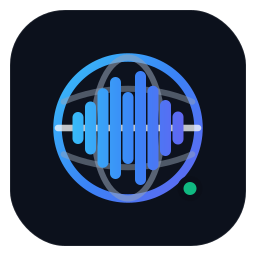

<div align="center">



# VoxPassport
### Local-First Live Translation, Captions, Voice Cloning & Text-to-Speech

VoxPassport is a modular local-first platform for full-duplex speech translation, synchronized captions, voice cloning, text translation, and synthesized speech routing into conferencing applications.

</div>

---

## Current product architecture

The canonical product UI is **one Expo + React Native + React Native Web client** under `apps/client`. There is no second desktop application shell and the retired HTML Studio/model-manager is no longer part of the repository.

```text
Expo / React Native Web client
        │ low-frequency typed control/session APIs
        ▼
VoxPassport integrated local runtime
        │
        ├── Modular VAD → ASR → Translation → TTS
        │
        ├── Direct speech-translation providers
        │
        └── Native desktop audio boundary
                 │
                 ├── Windows: WASAPI/MMDevice + WDM virtual cable
                 ├── macOS: CoreAudio + HAL AudioServerPlugIn
                 └── Linux: PipeWire/PipeWire-Pulse virtual sink/source
```

Raw realtime PCM does **not** travel through React state, REST JSON, or base64 UI messages. Desktop audio remains on native/subprocess media paths using the versioned `voxpassport.native-audio.v1` / `VPF1` frame contract.

English ↔ Romanian is the primary development and benchmark pair, but supported languages are determined by the selected ASR, translation, direct-speech, and TTS capabilities.

## Full-duplex routing

```text
Local Microphone                         Remote Conference Audio
      │                                           │
      ▼                                           ▼
     VAD                                         VAD
      │                                           │
      ▼                                           ▼
     ASR                                         ASR
      │                                           │
      ▼                                           ▼
 Translation                                  Translation
      │                                           │
      ▼                                           ▼
 TTS / Voice Clone                           TTS / Voice Clone
      │                                           │
      ▼                                           ▼
Virtual Microphone                           Local Monitor
```

Both directions can share physical model instances while maintaining independent language, queue, caption, and routing state.

## Native desktop audio status

| Platform | Physical/system audio | VoxPassport virtual microphone | Hosted validation | Still requires physical-machine validation |
| --- | --- | --- | --- | --- |
| Windows | WASAPI/MMDevice microphone, loopback, render | Pinned Microsoft Simple Audio Sample derivative with bounded kernel PCM ring | WDK source preparation, compile, signing/staging, Rust helper tests | Install under target Windows policy; real hardware formats; deterministic cable test; conferencing selection; echo/feedback |
| macOS | CoreAudio helper; macOS 14.2+ Core Audio process taps for system capture | HAL `AudioServerPlugIn` pair using libASPL | Swift build, HAL build/install/enumeration, deterministic sink→mic crossover, provider-shape PCM normalization | Real microphone/output devices, TCC prompts, production signing/notarization, conferencing behavior |
| Linux | PipeWire/PipeWire-Pulse discovery, capture, loopback and render | Persistent `VoxPassport Translation Sink` + `VoxPassport Virtual Microphone` | Rust/helper tests plus headless live PipeWire deterministic crossover | Distribution/session-specific desktop behavior and conferencing selection |

The system-facing virtual cable format is 48 kHz, signed 16-bit, stereo. Platform helpers normalize provider/native PCM at the native boundary.

## Voice profiles

A saved voice profile is model-independent:

```text
Reference recording
+ optional exact transcript
        ↓
Universal voice profile
        ↓
Active cloning-capable TTS
        ↓
Translated or supplied target text
        ↓
Speech in the enrolled speaker's voice
```

The exact transcript is required only when the selected TTS manifest declares it necessary. The Expo client owns typed record/stage/preview/save/activate/delete workflows; the Python runtime owns normalization, synthesis, persistent profile state, and active selection.

## TTS plugin architecture

Every local TTS model uses one application boundary:

```text
Main runtime
   ↓
ManifestTtsAdapter
   ↓
TTS Runtime Supervisor
   ├── Generic TTS worker → TtsDriver
   └── Optional reusable BackendRuntime
```

Model manifests own model identity/capabilities/driver settings. Backend runtime definitions own reusable server-family lifecycle metadata. Runtime profiles own dependency-compatible environments. The supervisor owns process topology, dynamic localhost endpoints, residency, hot swap, rollback, and recovery.

A new checkpoint on an existing backend family should normally require only a model manifest.

See [`docs/tts-plugin-architecture.md`](docs/tts-plugin-architecture.md).

## Model management

The canonical Expo Models & Engines screen uses typed runtime APIs for:

- installed/available model rendering;
- install and progress polling;
- active-slot switching;
- uninstall;
- backend-owned `installable` / `installation_reason` metadata;
- local/self-hosted runtime selection.

The UI does not infer installability from model names or legacy DOM/global state.

## Local-only and account-enabled deployments

VoxPassport can run without an account or hosted infrastructure.

For a personal/local deployment, create `.env` in the repository root with:

```env
VOXPASSPORT_LOCAL_ONLY=true
```

Local-only mode disables account/login/signup surfaces and hosted abuse controls. When account features are enabled, the optional account service uses PostgreSQL 18.6, Argon2id password hashing, short-lived access JWTs, rotating opaque refresh tokens, and AES-GCM-encrypted provider credentials.

Email verification, password reset, OAuth/social login, managed-cloud allocation, and mobile call transport are intentionally deferred product scope.

---

# Installation and local development

## Requirements

- Python 3.12
- Node.js/npm for the Expo client
- FFmpeg for imported voice-reference normalization
- Windows 10/11 for the current primary local development workflow
- NVIDIA CUDA GPU strongly recommended for realtime local inference

Model and VRAM requirements depend on the selected inference stack.

## Install

```bat
install.bat
```

`install.bat` provisions the primary Python environment and installs the canonical Expo client dependencies.

Optional isolated runtime profiles, such as Coqui/XTTS, are managed separately:

```bat
.venv\Scripts\python.exe scripts\manage_runtime_profile.py status coqui-xtts
.venv\Scripts\python.exe scripts\manage_runtime_profile.py install coqui-xtts
```

## Run

```bat
run.bat
```

The local development topology is:

| Service | Address | Purpose |
| --- | --- | --- |
| Expo web client | `http://127.0.0.1:8081` | Canonical product UI |
| Integrated runtime/API | `http://127.0.0.1:8766` | Models, voice profiles, runtime/session/native-audio control |
| Caption WebSocket | `ws://127.0.0.1:8765/ws/captions` | Caption/translation events |

TTS workers/backends use supervisor-owned ephemeral localhost endpoints and are not fixed services.

---

# Windows virtual-audio development

Build the pinned WDK driver package:

```powershell
powershell -ExecutionPolicy Bypass -File drivers\windows\virtual-audio\build.ps1 -Configuration Release -Platform x64
```

The hosted Windows CI now performs the WDK compile and verifies the staged INF/SYS package. Installing the driver still requires the target development machine and its permitted signing policy.

From elevated PowerShell after building:

```powershell
powershell -ExecutionPolicy Bypass -File drivers\windows\virtual-audio\install-test.ps1
```

Then build the Windows helper and validate actual PCM crossover:

```powershell
cargo build --manifest-path crates\audio-windows\Cargo.toml --bin voxpassport-audio-helper --release
.venv\Scripts\python.exe scripts\validate_virtual_audio.py
```

Only after this succeeds should the virtual microphone be tested in Meet/Zoom/Teams/Discord and full-duplex feedback ownership be accepted on the physical machine.

See [`drivers/windows/virtual-audio/README.md`](drivers/windows/virtual-audio/README.md).

# Linux virtual-audio development

A Linux desktop session needs PipeWire + PipeWire-Pulse. WSL alone does not guarantee an audio server; WSLg or another configured audio session is required for live endpoint testing.

```bash
cargo build --manifest-path crates/audio-linux/Cargo.toml --release
./drivers/linux/virtual-audio/install.sh
./crates/target/release/voxpassport-audio-helper probe
./crates/target/release/voxpassport-audio-helper devices
python scripts/validate_pipewire_virtual_audio.py
```

The headless Ubuntu CI starts PipeWire, WirePlumber and PipeWire-Pulse and runs this deterministic crossover path.

See [`drivers/linux/virtual-audio/README.md`](drivers/linux/virtual-audio/README.md).

# macOS virtual-audio development

```bash
swift build --package-path native/macos/audio-helper -c release
cmake -S drivers/macos/virtual-audio -B drivers/macos/virtual-audio/build -DCMAKE_BUILD_TYPE=Release
cmake --build drivers/macos/virtual-audio/build --config Release
```

Hosted macOS CI builds the helper/HAL driver, installs the HAL bundle, restarts Core Audio, enumerates both VoxPassport endpoints, verifies deterministic PCM crossover, and uninstalls the bundle. Physical Mac validation is still required for real microphones/outputs, TCC prompts, conferencing applications, and production signing/notarization.

See [`drivers/macos/virtual-audio/README.md`](drivers/macos/virtual-audio/README.md).

---

# Repository structure

```text
VoxPassport/
├── apps/
│   ├── client/                    Canonical Expo/React Native/Web product UI
│   └── browser-extension/         Optional browser-specific integration
├── runtime/                       Python inference/runtime/control plane
├── crates/
│   ├── audio-core/                Portable native audio contracts
│   ├── audio-windows/             Windows WASAPI/MMDevice helper
│   └── audio-linux/               Linux PipeWire/Pulse-compatible helper
├── native/macos/audio-helper/     macOS CoreAudio helper
├── drivers/
│   ├── windows/virtual-audio/     WDK virtual sink/microphone
│   ├── macos/virtual-audio/       HAL AudioServerPlugIn virtual pair
│   └── linux/virtual-audio/       PipeWire-Pulse virtual pair setup
├── account_api/                   Optional PostgreSQL-backed account service
├── docs/                          Architecture/operations/development docs
├── scripts/                       Validation/admin utilities
├── tests/                         Runtime/integration/architecture tests
└── .agents/plans/                 Implementation plans
```

Architectural ownership rules are documented in [`docs/development/repository-layout.md`](docs/development/repository-layout.md).

---

# Validation

GitHub CI currently covers:

- Python compilation and runtime-routing integrity tests;
- PostgreSQL 18.6 migrations/account-service integration tests;
- Expo TypeScript typecheck and static web export;
- Windows WDK driver compile/staged package verification;
- Windows portable/native Rust audio tests;
- Linux Rust audio tests;
- headless live Linux PipeWire virtual-cable crossover;
- macOS Swift helper build;
- macOS HAL build/install/enumeration/crossover/uninstall.

CI proves source/build and hosted virtual-media paths. It does not substitute for final physical-device/conferencing acceptance.

---

# Documentation

- [Runtime Architecture](docs/architecture.md)
- [Repository Layout and Ownership](docs/development/repository-layout.md)
- [Configuration](configs/README.md)
- [Audio Routing](docs/audio-routing.md)
- [Google Meet / Conferencing Integration](docs/google-meet-integration.md)
- [Troubleshooting](docs/troubleshooting.md)
- [TTS Plugin Architecture](docs/tts-plugin-architecture.md)
- [Model Registry](docs/model-registry.md)
- [Model Discovery Agent](docs/model-discovery-agent.md)
- [Model Licenses](docs/model-licenses.md)
- [Privacy & Security](docs/privacy-security.md)
- [Remote Workers](docs/remote-workers.md)

The active cross-platform/client migration plan is under `.agents/plans/in-progress/universal-expo-client-cloud-architecture-plan.md` until physical desktop acceptance is complete.
